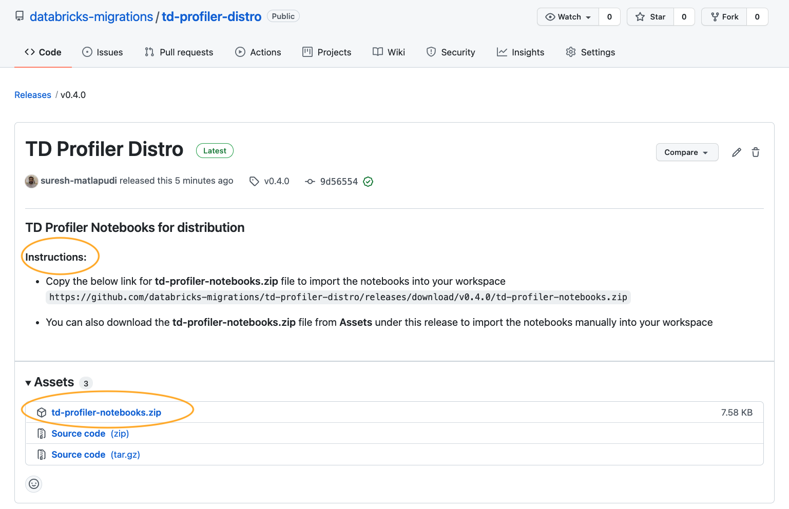
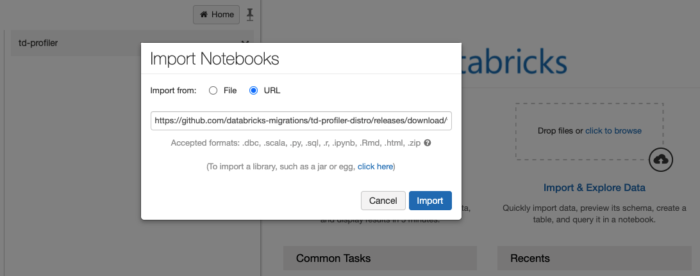
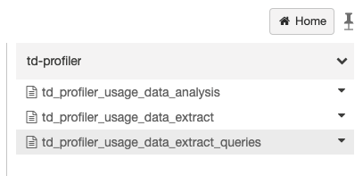
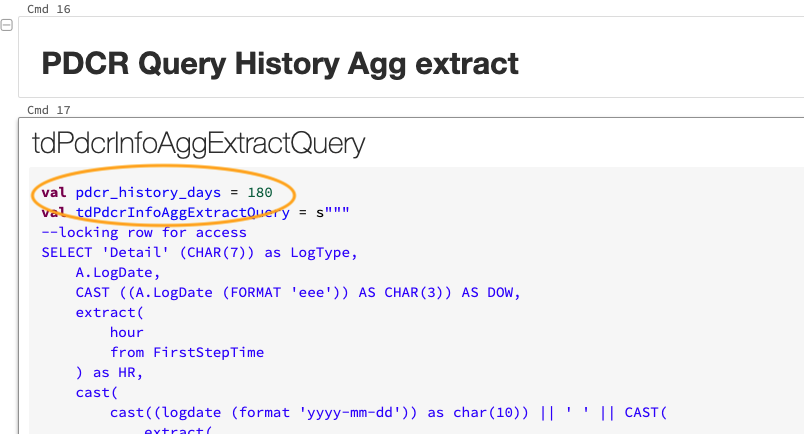
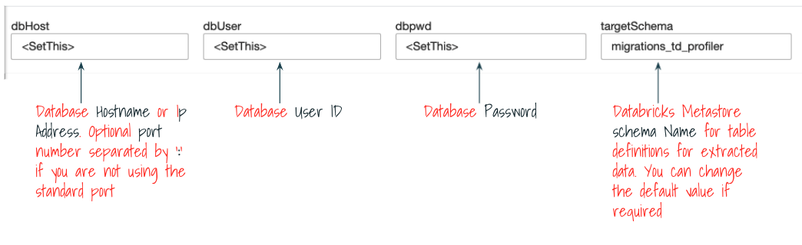

# TD Profiler

>### Prerequisites

1. Databricks Workspace to execute Profiler notebooks.
2. Network connectivity to Teradata Instance from Databricks Workspace.
3. Teradata PDCR (Performance Data Collection and Reporting) enabled and has data for a minimum of 90 days.
3. Teradata JDBC Driver
4. Teradata User id with SELECT grant on following tables/views
    
     | Database | Table/View | Purpose |
     | --- | --- | --- |
     | DBC      | DBCInfoTbl | Warehouse level information |
     | DBC      | ResUsageSpma | System utilization information |
     | DBC      | DiskSpaceV | Storage utilization information |
     | DBC      | TablesV | Warehouse objects information |
     | DBC      | FunctionsV | Warehouse objects information |
     | DBC      | ColumnsV |  Warehouse objects information |
     | PDCRINFO      | DBQlogTbl_Hst | Warehouse query/workload insights |
     | PDCRINFO      | UserInfo | Warehouse query/workload insights |
     | PDCRINFO      | DBQlSummaryTbl_Hst | Warehouse query/workload insights |


         
<p align="right">(<a href="#top">back to top</a>)</p>

>### Usage Instructions:
<br>


**TD Profiler Notebooks :**

* Notebooks are packaged as zip files and available under [td-profiler-repo Releases](https://github.com/databricks-migrations/td-profiler-distro/releases) for users to import them directly into their Databricks workspace.

* Always import from latest release tag. 


**Requried Cluster Configuration:**
- It is recommended to run the Teradata Usage data extract notebook in dedicated cluster.
- Create a new cluster with **Standard** Cluster Mode (Scala support is required for Notebook execution) and with two worker Nodes.
- Install the JDBC Driver jar library on the cluster. Refer [Cluster libraries](https://docs.databricks.com/libraries/cluster-libraries.html#cluster-libraries) section of Databricks documentation if you are haven't installed cluster libraries before.


**Import Notebooks into Workspace:**

* Create new folder with name **td-profiler** in Databricks Workspace
* Import latest version of Profiler Notebooks from distribution link into the **td-profiler** folder.
* Refer [Import an archive](https://docs.databricks.com/notebooks/notebooks-manage.html#import-an-archive) section of Databricks documentation for detailed steps. Choose **URL** option in Import dialog window to enter the link


**Notebooks Execution:**
* You will get the following notebooks in **td-profiler** workspace folder after import.

<br>

Use the Notebooks in the following sequence.
<br>

  **1) td_profiler_usage_data_extract_queries** :
  * No need to run this notebook. 
  * This notebook includes the SQL queries to extract Teradata usage data and these queries are used by `td_profiler_usage_data_extract` notebook.
  * You can review these queries.
  * If required you can also adjust the duration in number of days for the various queries to control the volume of the data.
        
<br>

  **2) td_profiler_usage_data_extract.scala** :
  * This is the first notebook you need to run.
  * Attach the notebook to cluster created above with required configuration
  * Run the `Cmd 2` cell with following content to create Notebook widgets to enter the JDBC connection details
    ```
      dbutils.widgets.text("dbHost", "<SetThis>")
      dbutils.widgets.text("dbUser", "<SetThis>")
      dbutils.widgets.text("dbpwd", "<SetThis>")
      dbutils.widgets.text("targetSchema", "migrations_td_profiler")
    ```
  * Enter input values for Notebook parameter
    
  * :information_source: `dbpwd` notebook widget will be removed after the execution of subsequent code cells in the notebook. If you need to re-enter the db password, re-run the `Cmd 2` again to recreate `dbpwd` notebook widget.
  * You can either run rest of the code cells in the Notebook individually or run the entire notebook by selecting the "Run All" option from the Notebook Menu.
  * Execution time of this Notebook depends on the volume of your usage data.
  * It is also recommended to run the profiler notebooks during off-peek hours.
<br>

  **3) td_profiler_usage_data_analysis.sql** :
  * Run this Notebook after the successful execution of `td_profiler_usage_data_extract`.
  * Export this notebook with execution results as `DBC Archive` format to share with Databricks team.

<p align="right">(<a href="#top">back to top</a>)</p>
